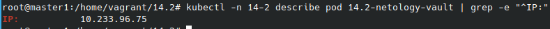

# Домашнее задание к занятию "14.2 Синхронизация секретов с внешними сервисами. Vault"

## Модуль 14. Сетевая безопасность в Kubernetes

### Студент: Иван Жиляев

## Задача 1: Работа с модулем Vault

>Запустить модуль Vault конфигураций через утилиту kubectl в установленном minikube
>
>```
>kubectl apply -f 14.2/vault-pod.yml
>```
>
>Получить значение внутреннего IP пода
>
>```
>kubectl get pod 14.2-netology-vault -o json | jq -c '.status.podIPs'
>```
>
>Примечание: jq - утилита для работы с JSON в командной строке
>
>Запустить второй модуль для использования в качестве клиента
>
>```
>kubectl run -i --tty fedora --image=fedora --restart=Never -- sh
>```
>
>Установить дополнительные пакеты
>
>```
>dnf -y install pip
>pip install hvac
>```
>
>Запустить интепретатор Python и выполнить следующий код, предварительно
>поменяв IP и токен
>
>```
>import hvac
>client = hvac.Client(
>    url='http://10.10.133.71:8200',
>    token='aiphohTaa0eeHei'
>)
>client.is_authenticated()
>
># Пишем секрет
>client.secrets.kv.v2.create_or_update_secret(
>    path='hvac',
>    secret=dict(netology='Big secret!!!'),
>)
>
># Читаем секрет
>client.secrets.kv.v2.read_secret_version(
>    path='hvac',
>)
>```

Контейнер с Vault без труда был поднят, смотрим его адрес:  


Контейнер с fedora был запущен, в нём установили всё необходимое и выполняем предложенную проверку работы с Vault:  


## Задача 2 (*): Работа с картами конфигураций внутри модуля

>* На основе образа fedora создать модуль;
>* Создать секрет, в котором будет указан токен;
>* Подключить секрет к модулю;
>* Запустить модуль и проверить доступность сервиса Vault.

Я создал соответствующие манифесты для модуля на федоре [fedora-pod.yml](14.2/fedora-pod.yml) и для секрета [mysecret-secret.yml](14.2/mysecret-secret.yml). Для удобства модуль запускается с основным процессом `sleep infinity`, что позволит подключиться к нему и выполнить необходимые проверки. Токен в манифесте секрета я попробовал указать в обычной (не base64) кодировке с помощью директивы `stringData` и это сработало - кластер при создании объекта сам перевёл данные в нужную кодировку.

Проверим содержимое секрета:  


Теперь можно подключиться в контейнер с федорой командой `kubectl -n 14-2 exec 14.2-netology-fedora -it -- bash` и проверить наличие переменной с корректным токеном в окружении:  


Напоследок установим необходимые зависимости и проверить работу модуля с хранилищем из пайтон с использованием созданной переменной:  


---

### Как оформить ДЗ?

>Выполненное домашнее задание пришлите ссылкой на .md-файл в вашем репозитории.
>
>В качестве решения прикрепите к ДЗ конфиг файлы для деплоя. Прикрепите скриншоты вывода команды kubectl со списком запущенных объектов каждого типа (pods, deployments, statefulset, service) или скриншот из самого Kubernetes, что сервисы подняты и работают, а также вывод из CLI.

---
