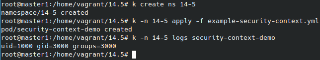
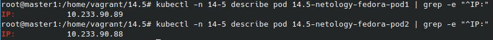
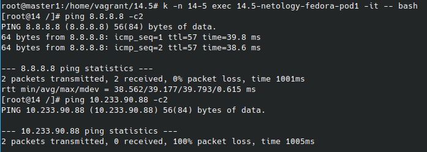
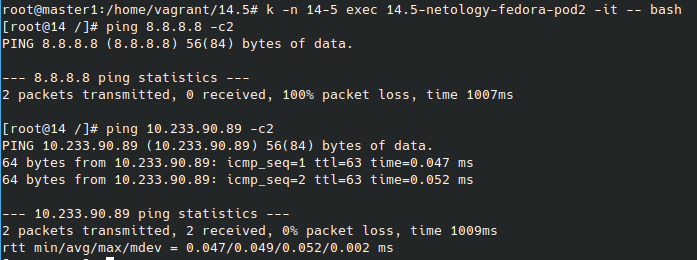

# Домашнее задание к занятию "14.5 SecurityContext, NetworkPolicies"

## Модуль 14. Сетевая безопасность в Kubernetes

### Студент: Иван Жиляев

## Задача 1: Рассмотрите пример 14.5/example-security-context.yml

>Создайте модуль
>
>```
>kubectl apply -f 14.5/example-security-context.yml
>```
>
>Проверьте установленные настройки внутри контейнера
>
>```
>kubectl logs security-context-demo
>uid=1000 gid=3000 groups=3000
>```

Модуль создан из данного манифеста. Параметры в поде соответствуют ожидаемым:  


## Задача 2 (*): Рассмотрите пример 14.5/example-network-policy.yml

>Создайте два модуля. Для первого модуля разрешите доступ к внешнему миру и ко второму контейнеру. Для второго модуля разрешите связь только с первым контейнером. Проверьте корректность настроек.

Создаваемые модули описаны в файле [two_pods.yml](two_pods.yml), сетевые политики - в файле [two_networkpolicys.yml](two_networkpolicys.yml).

Проверка будет заключаться в следующем:
- поднимем поды и установим в них утилиту ping командой `yum install iputils -y` - ей будем проверять сетевой доступ
- добавим сетевые политики
- получим IP-адреса подов командами:
    ```
    kubectl -n 14-5 describe pod 14.5-netology-fedora-pod1 | grep -e "^IP:"
    kubectl -n 14-5 describe pod 14.5-netology-fedora-pod2 | grep -e "^IP:"
    ```
    
- согласно настройкам из первого пода **можно** будет пинговать внешний ресурс и **нельзя** второй под, проверим:  

- согласно настройкам из второго пода **можно** будет пинговать первый под, но **нельзя** внешний ресурс, проверим:  


Поведение подов полностью соответствует ожиданиям, сетевые политики работают.

---

### Как оформить ДЗ?

>Выполненное домашнее задание пришлите ссылкой на .md-файл в вашем репозитории.
>
>В качестве решения прикрепите к ДЗ конфиг файлы для деплоя. Прикрепите скриншоты вывода команды kubectl со списком запущенных объектов каждого типа (pods, deployments, statefulset, service) или скриншот из самого Kubernetes, что сервисы подняты и работают, а также вывод из CLI.

---
