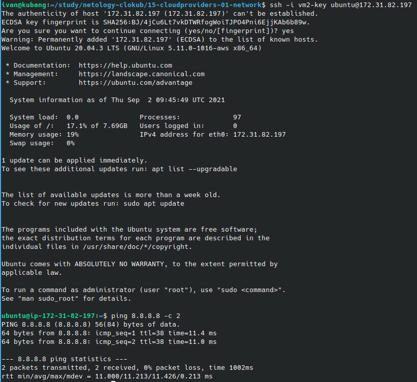

# Домашнее задание к занятию "15.1. Организация сети"

## Модуль 15. Организация проекта при помощи облачных провайдеров

### Студент: Иван Жиляев

## Задача 1:

>Настроить Production like сеть в рамках одной зоны с помощью terraform. Модуль VPC умеет автоматически делать все что есть в этом задании. Но мы воспользуемся более низкоуровневыми абстракциями, чтобы понять, как оно устроено внутри.
>
>1. Создать VPC.
>
>- Используя vpc-модуль terraform, создать пустую VPC с подсетью 172.31.0.0/16.
>- Выбрать регион и зону.

Я разбил структуру манифеста terraform по нескольким файлам: общие элементы оставил в [terraform/main.tf](terraform/main.tf), а объекты создаваемые для заданий в соответствующих файлах. Так VPC описана в файле [terraform/task1.tf](terraform/task1.tf).

>2. Публичная сеть.
>
>- Создать в vpc subnet с названием public, сетью 172.31.32.0/19 и Internet gateway.
>- Добавить RouteTable, направляющий весь исходящий трафик в Internet gateway.
>- Создать в этой приватной сети виртуалку с публичным IP и подключиться к ней, убедиться что есть доступ к интернету.

Все необходимые объекты AWS описаны в файле [terraform/task2.tf](terraform/task2.tf).  
Проверка работы публичной сети сделана на виртуалке с именем vm1:  


>3. Приватная сеть.
>
>- Создать в vpc subnet с названием private, сетью 172.31.96.0/19.
>- Добавить NAT gateway в public subnet.
>- Добавить Route, направляющий весь исходящий трафик private сети в NAT.

В файле [terraform/task3.tf](terraform/task3.tf) добавим нужные объекты.  

>4. VPN.
>
>- Настроить VPN, соединить его с сетью private.
>- Создать себе учетную запись и подключиться через нее.
>- Создать виртуалку в приватной сети.
>- Подключиться к ней по SSH по приватному IP и убедиться, что с виртуалки есть выход в интернет.

Для настройки VPN потребуются сертификаты сервера и клиента. Создадим их с помощью [инструкции из документации AWS](https://docs.aws.amazon.com/vpn/latest/clientvpn-admin/client-authentication.html#mutual).

```
git clone https://github.com/OpenVPN/easy-rsa.git
cd easy-rsa/easyrsa3/
./easyrsa init-pki
./easyrsa build-ca nopass
./easyrsa build-server-full server nopass
./easyrsa build-client-full client1.domain.tld nopass
mkdir -p ../../terraform/certs/
cp pki/ca.crt pki/issued/server.crt pki/private/server.key pki/issued/client1.domain.tld.crt pki/private/client1.domain.tld.key ../../terraform/certs/
cd../../terraform/certs/
```

Сгенерированные сертификаты будут доставлены в ACM ресурсами terraform из манифеста [terraform/task4.tf](terraform/task4.tf).

Дальнейшая настройка опирается на [этот мануал](https://timeular.com/blog/creating-an-aws-client-vpn-with-terraform/) - по нему написаны остальные объекты в манифесте [terraform/task4.tf](terraform/task4.tf).

Проверять подключение к VPN будем через OpenVPN, основу конфигурации для подключения скачаем с веб-консоли AWS в файл [downloaded-client-config.ovpn](downloaded-client-config.ovpn). Конфигурацию нужно дополнить данными клиентского сертификата согласно [инструкции](https://docs.aws.amazon.com/vpn/latest/clientvpn-admin/cvpn-getting-started.html#cvpn-getting-started-config).

Команда для подключения к VPN выглядит так:

```
sudo openvpn --config downloaded-client-config.ovpn
```

Посмотрим внутренний адрес виртуалки vm2, добавленной в частную сеть, подключимся на него по SSH и пропингуем гугл:  


Проверка завершена успешно.

>Документация по AWS-ресурсам:
>
>- [Getting started with Client VPN](https://docs.aws.amazon.com/vpn/latest/clientvpn-admin/cvpn-getting-started.html)
>
>Модули terraform
>
>- [VPC](https://registry.terraform.io/providers/hashicorp/aws/latest/docs/resources/vpc)
>- [Subnet](https://registry.terraform.io/providers/hashicorp/aws/latest/docs/resources/subnet)
>- [Internet Gateway](https://registry.terraform.io/providers/hashicorp/aws/latest/docs/resources/internet_gateway)
