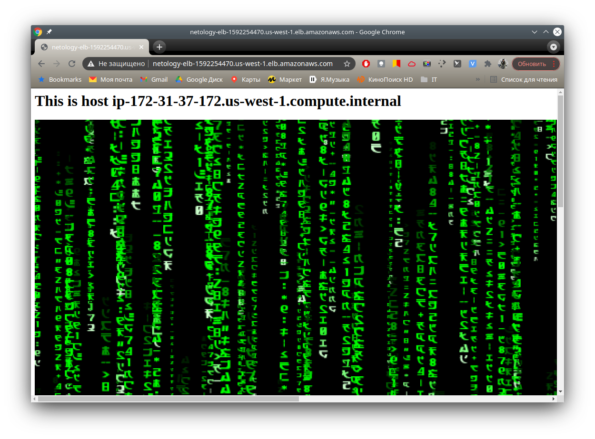

# Домашнее задание к занятию 15.2 "Вычислительные мощности. Балансировщики нагрузки".

## Модуль 15. Организация проекта при помощи облачных провайдеров

### Студент: Иван Жиляев

>Используя конфигурации, выполненные в рамках ДЗ на предыдущем занятии добавить к Production like сети Autoscaling group из 2 EC2-инстансов с  автоматической установкой web-сервера в private домен. Создать приватный домен в Route53, чтобы был доступ из VPN.

Конфигурацию из предыдущего задания я реструктурировал для удобства восприятия проименовав манифесты согласно их функционалу.

## Задание 1. Создать bucket S3 и разместить там файл с картинкой.

>- Создать бакет в S3 с произвольным именем (например, имя_студента_дата).
>- Положить в бакет файл с картинкой.
>- Сделать доступным из VPN используя ACL.

---

Бакет s3 и объект в нём создаются манифестом [terraform/task1.tf](terraform/task1.tf). В качестве объекта загружается [картинка](terraform/image.png) из этого репозитория.

## Задание 2. Создать запись в Route53 домен с возможностью определения из VPN.

>- Сделать запись в Route53 на приватный домен, указав адрес LB.

---

Нужные сущности создаются манифестом [terraform/task2.tf](terraform/task2.tf).  
_Адрес LB будет указан после выполнения задания 3._

## Задание 3. Загрузить несколько ЕС2-инстансов с веб-страницей, на которой будет картинка из S3.

>- Сделать Launch configurations с использованием bootstrap скрипта с созданием веб-странички на которой будет ссылка на картинку в S3.
>- Загрузить 3 ЕС2-инстанса и настроить LB с помощью Autoscaling Group.

В манифесте [terraform/task3.tf](terraform/task3.tf) опишем новое правило для фаервола для доступа к 80-му порту, скрипт для поднятия веб-сервера на инстансах, шаблон инстансов, классический балансировщик нагрузки и группу автоскейлинга.

Добавим также секцию output для отображения dns-имени созданного балансировщика для проверки его работы. Проверку выполним зайдя на полученный URL и несколько раз обновим страницу: т.к. каждый инстанс кроме картинки с S3 отображает своё имя, то мы сразу увидим работает ли балансировщик. 

Привожу серию скриншотов, показывающую, что всё работает как надо:  
  
  

